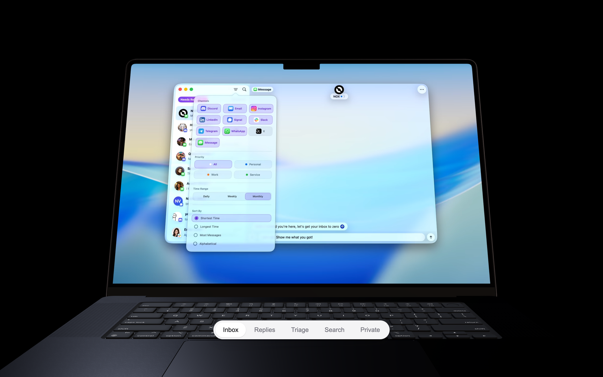

# rigged-macbook-3d

A genuinely rigged 3D MacBook for React — an openable lid on a real hinge, a video/image screen
with crossfade, studio lighting presets, and an optional zero-dependency scroll journey.



Live demo: [rigged-macbook-3d-demo.vercel.app](https://rigged-macbook-3d-demo.vercel.app)

## Why this exists

Most "macbook scroll" effects on the web are CSS transforms over a flat image — a mockup baked
into a PNG, faked in 2D with perspective and drop shadows. That works until you need the lid to
actually open, the screen to actually show your product video, or the camera to move around the
device in a real scene.

`rigged-macbook-3d` ships an actual rigged GLB: a lid split at the hinge seam and reparented under
a pivot node, a screen mesh you can texture with any video or image, and materials tuned for a
believable Space Black finish. It's a headless `@react-three/fiber` component — drop it into any
R3F canvas and drive `open`, `brightness`, and the screen content from whatever state you already
have: scroll position, a spring, a Framer Motion value, or a plain `useState`.

## Install

```bash
npm i rigged-macbook-3d three @react-three/fiber @react-three/drei
```

`react` and `react-dom` ≥18 are required as peers (installed automatically if you already have a
React app). Also required as peers: `three` ≥0.160, `@react-three/fiber` ≥8.18,
`@react-three/drei` ≥9.122.

## Quickstart

```tsx
import { Macbook, MacbookStage } from 'rigged-macbook-3d';

export default function Hero() {
  return (
    <div style={{ height: 600 }}>
      <MacbookStage lighting="studio-dark">
        <Macbook open={1} screen="/demo.mp4" />
      </MacbookStage>
    </div>
  );
}
```

## The scroll journey

`MacbookScroll` is the full pinned scroll effect — the wrapper pins a sticky viewport, maps scroll
position to a damped progress value, and drives the lid, the screen walkthrough, and the camera
pose from it. It needs no scroll library. Trimmed from
[`demo/src/Journey.tsx`](demo/src/Journey.tsx):

```tsx
import { useRef, useState } from 'react';
import { MacbookScroll, type MacbookScrollHandle } from 'rigged-macbook-3d';
import TabBar from './TabBar';

const SCREENS = [
  { src: '/videos/inbox1.webm', fallbackSrc: '/videos/inbox1.mp4', label: 'Inbox' },
  { src: '/videos/replies1.webm', fallbackSrc: '/videos/replies1.mp4', label: 'Replies' },
  { src: '/videos/triage1.webm', fallbackSrc: '/videos/triage1.mp4', label: 'Triage' },
];

export default function Journey() {
  const scrollRef = useRef<MacbookScrollHandle>(null);
  const [active, setActive] = useState(0);

  return (
    <MacbookScroll
      ref={scrollRef}
      height="600vh"
      screens={SCREENS}
      onActiveScreen={setActive}
      fallback={<div className="hero">Here's a quiet fallback instead.</div>}
    >
      <TabBar labels={SCREENS.map((s) => s.label)} active={active} onSelect={(i) => scrollRef.current?.scrollToScreen(i)} />
    </MacbookScroll>
  );
}
```

Every beat of the journey — when the device fades in, when the lid opens, when the camera dives
in, the screen walkthrough band, the recede at hand-off — is a `[start, end]` pair on 0–1 scroll
progress, overridable via the `timeline` prop. The `poses` prop overrides the intro/dive/outro
camera poses, and `feel` tunes the damped-follow feel (smooth time, max speed, per-screen minimum
dwell, crossfade fraction). Unspecified fields in any of these keep the tuned defaults — see the
[API reference](#api-reference) below for the full shape, and
[`demo/src/Journey.tsx`](demo/src/Journey.tsx) / [`demo/src/TabBar.tsx`](demo/src/TabBar.tsx) for
the complete tab-bar-driven example.

## API reference

### `<Macbook>`

The rigged model itself. Headless and controlled — renders exactly the state its props (or
`frameDriver`) describe.

| Prop | Type | Default | Description |
| --- | --- | --- | --- |
| `open` | `number` | `1` | Lid amount: 0 = closed, 1 = fully open. Linear — apply your own easing. |
| `screen` | `ScreenInput` | — | Single screen content (sugar for `screens={[screen]}`). |
| `screens` | `ScreenInput[]` | — | Screen playlist; crossfade between entries with `screenIndex`/`screenMix`. |
| `screenIndex` | `number` | `0` | Active playlist entry. |
| `screenMix` | `number` | `0` | 0–1 crossfade from `screenIndex` toward `screenIndex + 1`. Raw — apply your own easing. |
| `brightness` | `number` | `1` | Screen wake: 0 = black, 1 = full. |
| `autoPlayScreens` | `boolean` | `true` | Auto play/pause videos so only visible entries decode (paused while the lid is shut). |
| `modelSrc` | `string` | — | Self-hosting escape hatch. Must be this package's `assets/macbook-rigged.glb` (copy it from `node_modules`) — the rig is welded to that file; other models throw. |
| `onLoad` | `() => void` | — | Called once the model is rigged and ready. |
| `frameDriver` | `() => MacbookFrameState` | — | Advanced: per-frame state source, called inside the render loop. Returned fields (`open`, `brightness`, `screenIndex`, `screenMix`) override the matching props each frame — drive state from scroll positions or MotionValues without re-rendering React. |

`<Macbook>` also accepts every prop `@react-three/fiber`'s `<group>` accepts (e.g. `position`,
`rotation`, `scale`), and forwards a ref to the underlying `THREE.Group`.

### `<MacbookLighting>`

Lighting rigs tuned for the Space-Black MacBook.

| Prop | Type | Default | Description |
| --- | --- | --- | --- |
| `preset` | `'studio-dark' \| 'studio-light' \| 'soft'` | `'studio-dark'` | Built-in rig to use — the tuned Space-Black look. |
| `intensity` | `number` | `1` | Scales every light in the preset. |
| `children` | `ReactNode` | — | Escape hatch: children REPLACE the preset entirely (bring your own lights). |

### `<MacbookStage>`

A ready-to-go stage: wrapper div + `<Canvas>` with the tuned camera (z 6, fov 32), ACES filmic
tone mapping, and a lighting preset. Drop a `<Macbook>` inside. For existing R3F apps, skip this
and use `<Macbook>` + `<MacbookLighting>` directly.

| Prop | Type | Default | Description |
| --- | --- | --- | --- |
| `lighting` | `LightingPreset` | `'studio-dark'` | Lighting preset for the stage. |
| `lightingIntensity` | `number` | `1` | Scales the preset's lights. |
| `pauseWhenOffscreen` | `boolean` | `true` | Park the frameloop (and GPU) while the stage is off-screen. |
| `className` | `string` | — | Wrapper div class (defaults to 100%/100% sizing). |
| `style` | `CSSProperties` | — | Wrapper div style. |
| `children` | `ReactNode` | — | Rendered inside the `<Canvas>`. |

`<MacbookStage>` also accepts every prop `@react-three/fiber`'s `<Canvas>` accepts (except
`children`), so you can override the camera, `dpr`, `gl`, etc.

### `<MacbookScroll>`

The full scroll journey with zero scroll-library dependencies: a tall wrapper pins a sticky
viewport; scroll maps to a target progress; a critically-damped follow (with per-phase speed
caps) chases it, so wheel steps become fluid motion and everything reverses exactly.

| Prop | Type | Default | Description |
| --- | --- | --- | --- |
| `screens` | `(string \| ScreenSource)[]` | — | The screen walkthrough content, in order. |
| `height` | `string` | `'600vh'` | Total scroll length of the pinned journey. |
| `lighting` | `LightingPreset` | `'studio-dark'` | Lighting preset. |
| `timeline` | `Partial<Timeline>` | — | Override any journey beats; unspecified beats keep the tuned defaults. |
| `poses` | `PosesPartial` | — | Override any pose values; unspecified values keep the tuned defaults. |
| `feel` | `Partial<Feel>` | — | Override the scroll feel; unspecified values keep the tuned defaults. |
| `pointerParallax` | `boolean` | `true` | Cursor-follow tilt once dived in. |
| `fallback` | `ReactNode` | `null` | Rendered INSTEAD of the journey when the client lacks WebGL2 or prefers reduced motion. |
| `className` | `string` | — | Wrapper class. |
| `modelSrc` | `string` | — | Self-hosting escape hatch — see `<Macbook modelSrc>`. |
| `onProgress` | `(p: number) => void` | — | Fires with the smoothed progress whenever it changes. |
| `onActiveScreen` | `(index: number) => void` | — | Fires when the dominant screen changes — drive tab bars/captions from this. |
| `children` | `ReactNode` | — | Overlay content rendered inside the sticky viewport, above the canvas. |

`<MacbookScroll>` forwards a ref exposing `MacbookScrollHandle`: `scrollToScreen(index: number)`
(smooth-scrolls the page so the journey lands on that screen) and a read-only `progress` getter
(current smoothed journey progress, 0–1).

### Hooks & utilities

- **`useScreenTextures(sources: ScreenInput[])`** — turns screen inputs (video URLs, image URLs,
  or ready textures) into an index-aligned list of `THREE.Texture`s, with `setPlaying`/`pauseAll`
  to control video decode.
- **`useCapabilityGate()`** — `boolean | null`; whether this client should get the 3D experience
  (WebGL2 available and `prefers-reduced-motion` not set). `null` on first render (SSR-safe).
- **`screenAt(p, count, band, crossfadeFraction?)`** — where the screen walkthrough is at
  progress `p`: the current index, the next index blending in, and the raw 0–1 blend amount.
- **`journeyState(p, timeline, poses, screenCount, crossfadeFraction)`** — the journey's pure
  progress → frame-state mapping (`deviceIn`, `open`, `brightness`, `pose`, `screenIndex`,
  `screenMix`).
- **`speedCapAt(sp, timeline, feel, screenCount)`** — per-frame speed cap for the damped follow.
- **`ramp`, `easeInOut`, `lerp`, `clamp01`, `smoothDamp`** — the small math helpers the journey is
  built from.
- **`DEFAULT_MODEL_URL`, `DEFAULT_TIMELINE`, `DEFAULT_POSES`, `DEFAULT_FEEL`, `LID`, `SEAT`,
  `FIT_SIZE`** — the tuned defaults, exported so you can read (or partially override, via
  `resolveTimeline`/`resolvePoses`/`resolveFeel`) the values `MacbookScroll` merges over.

## Recipes

**Open on hover** (simple lerp inside `frameDriver`, no extra dependency):

```tsx
const targetOpen = useRef(0);
const openNow = useRef(0);
<div onPointerEnter={() => (targetOpen.current = 1)} onPointerLeave={() => (targetOpen.current = 0)}>
  <MacbookStage>
    <Macbook
      screen="/demo.mp4"
      frameDriver={() => {
        openNow.current += (targetOpen.current - openNow.current) * 0.08;
        return { open: openNow.current };
      }}
    />
  </MacbookStage>
</div>
```

**Rotate with mouse** (group rotation from pointer, no `frameDriver` needed):

```tsx
const groupRef = useRef<THREE.Group>(null);
useFrame((state) => {
  if (!groupRef.current) return;
  groupRef.current.rotation.y = (state.pointer.x * Math.PI) / 8;
  groupRef.current.rotation.x = (state.pointer.y * Math.PI) / 16;
});
<group ref={groupRef}>
  <Macbook open={1} screen="/demo.mp4" />
</group>
```

**Framer Motion binding** (`frameDriver` reads a `MotionValue` every frame, no re-renders):

```tsx
const openMV = useMotionValue(0);
<Macbook screen="/demo.mp4" frameDriver={() => ({ open: openMV.get() })} />
// elsewhere: animate(openMV, 1, { type: 'spring', stiffness: 120, damping: 20 });
```

**Custom lighting** (children of `MacbookLighting` replace the preset entirely):

```tsx
<MacbookStage>
  <MacbookLighting>
    <ambientLight intensity={0.4} />
    <directionalLight position={[5, 8, 6]} intensity={1.2} />
  </MacbookLighting>
  <Macbook open={1} screen="/demo.mp4" />
</MacbookStage>
```

## Next.js note

Every component in this package is a client component (they use `useFrame`, DOM APIs, and video
elements). With the App Router, wrap the stage/scroll components in `next/dynamic` with
`ssr: false`:

```tsx
'use client';
import dynamic from 'next/dynamic';

const MacbookStage = dynamic(() => import('rigged-macbook-3d').then((m) => m.MacbookStage), { ssr: false });
```

## The model

By default, `<Macbook>` and `<MacbookScroll>` load the bundled model from a versioned CDN URL
(`https://unpkg.com/rigged-macbook-3d@<version>/assets/macbook-rigged.glb`) — pinned to the
package version you installed, so it never changes underneath you. To self-host, copy
`node_modules/rigged-macbook-3d/assets/macbook-rigged.glb` into your own static assets and pass
its URL as `modelSrc`.

No other model works: the rig (hinge split, node names `LidPivot`/`Screen`, the seat-lift math)
is welded to this specific file, and passing a different GLB via `modelSrc` throws. The model
itself is fixed and non-swappable — you customize the experience through props and lighting, not
by bringing your own geometry.

Multiple `<Macbook>` instances on the same page are supported: each instance clones the loaded
GLTF's node hierarchy on mount (geometries and materials stay shared across clones, so the memory
cost of extra instances is small), and wires its own hinge pivot and screen materials onto that
clone. `@react-three/drei`'s `useGLTF` caches and shares one source scene across every `<Macbook>`
that requests the same `modelSrc`; cloning is what lets more than one of them mount it at once
without fighting over which parent owns the shared object.

## Fallbacks & accessibility

Both `<Macbook>`'s host canvas and `<MacbookScroll>` rely on `useCapabilityGate`, which checks for
WebGL2 support and respects `prefers-reduced-motion`. `<MacbookScroll>` uses this directly: it
renders nothing (just a height-holding placeholder) on the very first render (SSR-safe), then
either the journey or the `fallback` prop's content once the check resolves — and once downgraded
to the fallback, it never reverts, since remounting a 3D scene under the user is its own kind of
motion.

If you're composing `<Macbook>`/`<MacbookStage>` yourself outside of `<MacbookScroll>`, call
`useCapabilityGate()` in your own component and branch on it the same way. Whatever you render as
a fallback, make it meaningful non-3D content — a static screenshot, a short description, or a
video of the effect — not an empty div; a meaningful share of users will see it.

## Credits & license

Code is MIT licensed (see [LICENSE](LICENSE)). The 3D model — "MacBook Pro M3 16-inch 2024" by
[jackbaeten](https://sketchfab.com/3d-models/macbook-pro-m3-16-inch-2024-8e34fc2b303144f78490007d91ff57c4) —
is CC-BY 4.0, with modifications (Space Black recolour, hinge split and pivot rig, screen panel
isolation, meshopt compression) noted in full in [CREDITS.md](CREDITS.md).

This project is not affiliated with or endorsed by Apple Inc. "MacBook" is a trademark of Apple
Inc., depicted here nominatively to describe what the model portrays.
